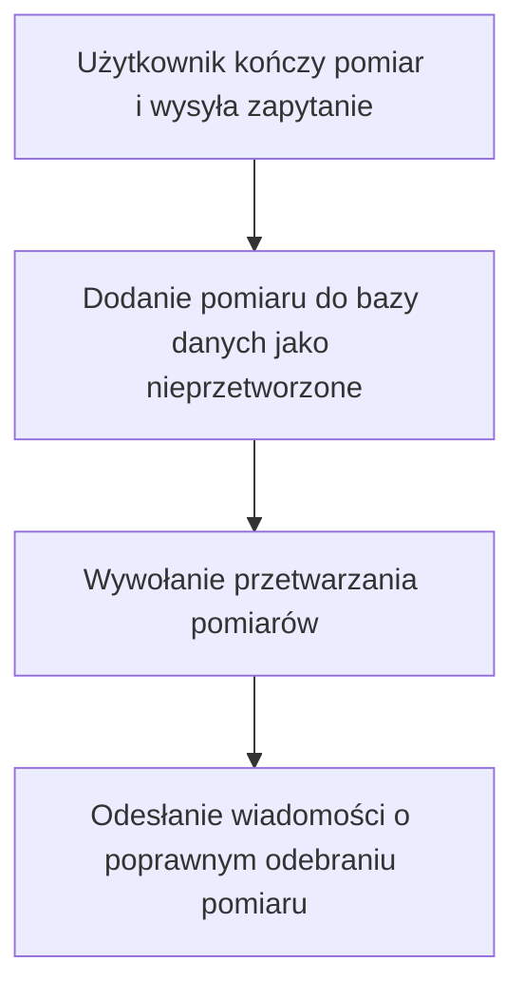
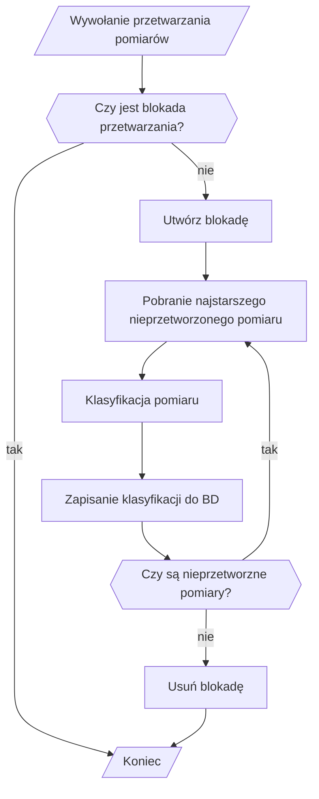
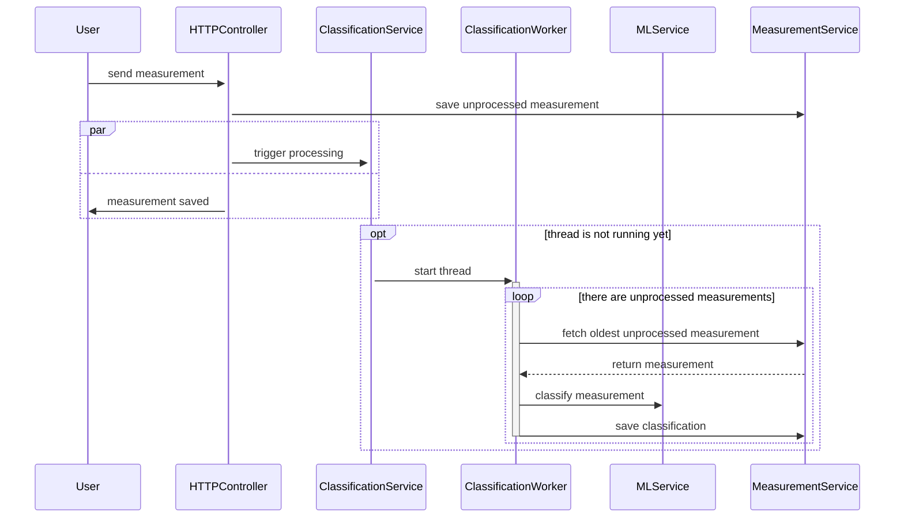
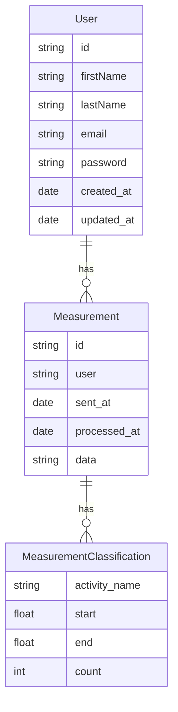

# Przetwarzanie danych
Zalogowani użytkownicy będą mogli wysłać pomiary do analizy, czyli klasyfikacji
swojego treningu.

## Propozycja
Niech proces przetwarzania zaczyna się po otrzymaniu zapytania od użytkownika.
Ponieważ w trakcie przetwarzania tego zapytania, inni użytkownicy mogą przesłać swoje pomiary,
te pomiary muszą być przechowywane w bazie danych i oznaczone jako nieprzetworzone. Klasyfikacja może być wymagająca sprzętowo, dlatego nie będzie przetwarzania równoległego.

Proces przetwarzania nie zakończy się dopóki w bazie danych nie będzie już więcej rekordów oznaczonych
jako "nieprzetworzone". Po skończeniu przetwarzania jednego pomiaru, z bazy danych wyciągnie kolejny jeszcze nieprzetworzony.

### Proces odbierania zapytania

### Proces przetwarzania pomiarów

# ERD

